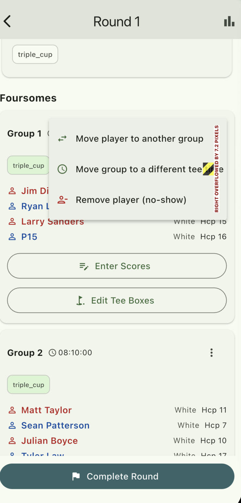
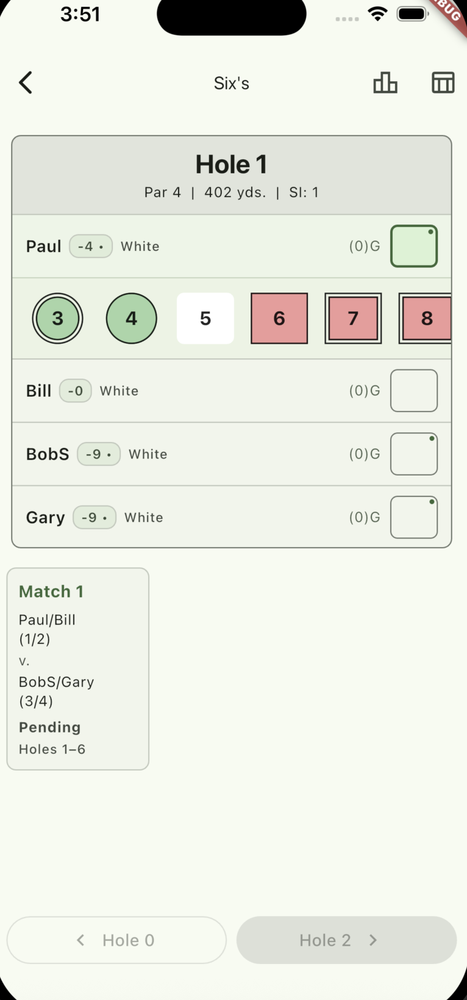
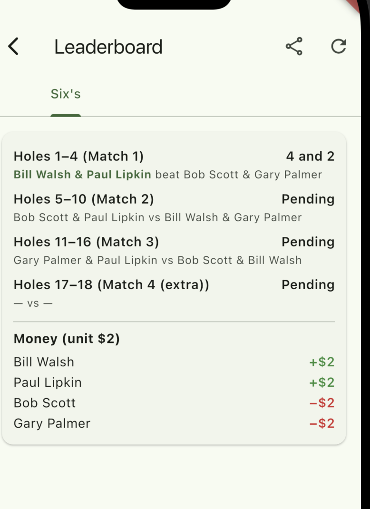
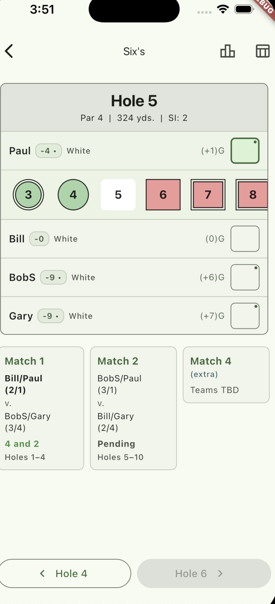
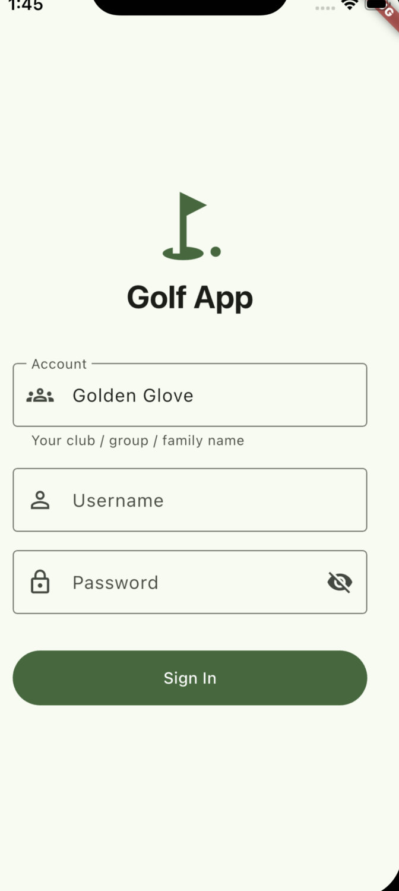
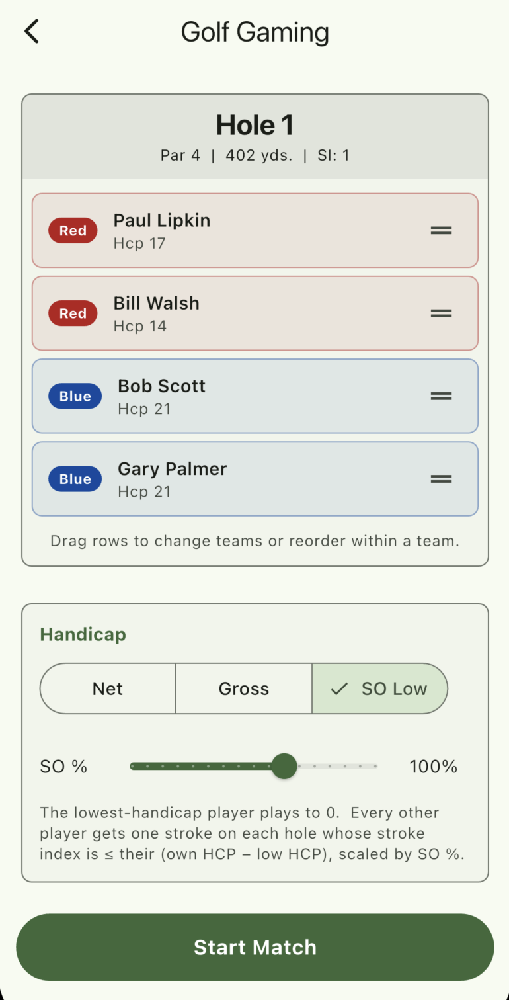
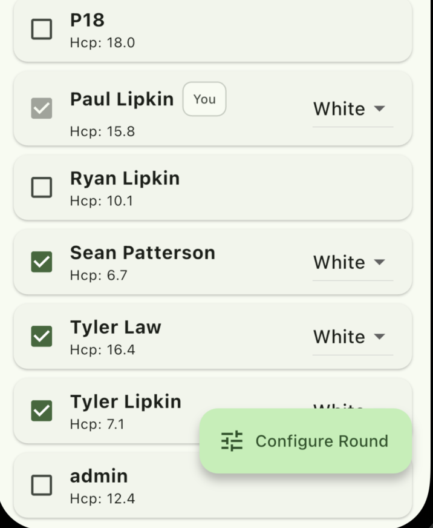
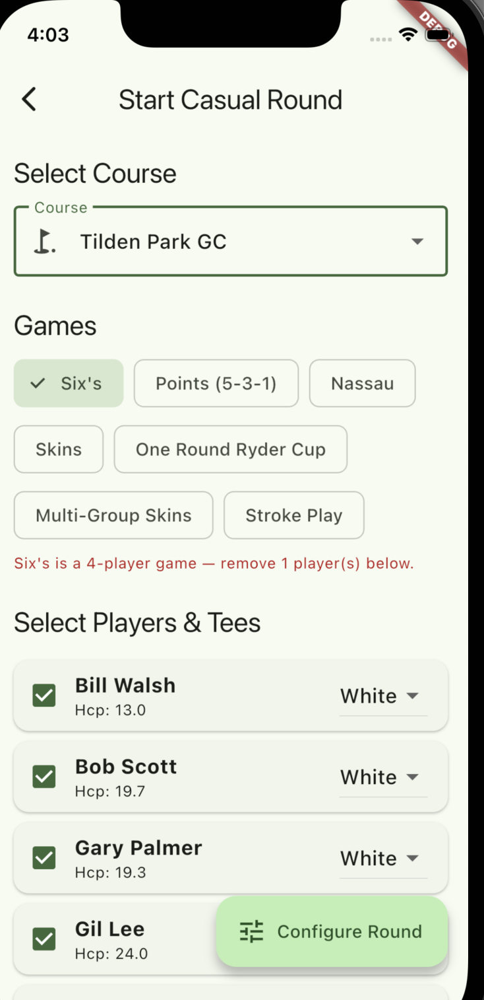
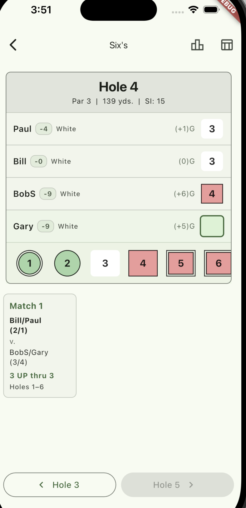

# Golf App — Design Consistency Audit

> **Scope:** Mobile (Flutter) · Overview screens + Sixes game flow
> **Screens reviewed:** 14
> **Stack:** Flutter · Material 3 (seed `#2E7D32`)

A read of the current mobile design. The visual foundation is solid; the rough edges are almost entirely **consistency drift across hand-written screens** plus a handful of real bugs visible in the simulator.

---

## How to use this document

This is a handoff document. The intended consumer is a coding agent (e.g. Claude Code) operating on the `golf-app` repo.

- **Sections 3 (bugs) and 4 (drift) are the work queue.** Each finding has a stable ID (`B-01`, `D-02`, …) you can reference in commits and PRs.
- **Section 5** is the target — a small set of shared widgets that, once built, prevent new drift.
- **Section 6** sequences the work by impact-per-hour.
- Screenshots referenced from `./screens/` show the offending state. Open them inline when investigating a finding.

---

## 1. TL;DR — Six things to fix first

| # | Type | Finding | Why it matters |
|---|---|---|---|
| 1 | Bug | **Debug build is in use** | Red "DEBUG" ribbon and overflow stripes visible. Build release/profile before screenshots or testing. |
| 2 | Bug | **"Six's" should be "Sixes"** | Game is "Sixes" (six-six-six). Code uses `sixes`; UI must match. |
| 3 | Drift | **Three primary-button styles** | Dark green pill, light green FAB pill, teal pill — no rule explaining which to use. |
| 4 | Drift | **Page titles have no rhythm** | "Casual Rounds", "Start Casual Round", "Golf Gaming", "Six's", "Leaderboard" — five different shapes. |
| 5 | UX | **FAB blocks list content** | "Configure Round" / "New Casual Round" pills overlap the last visible list row. |
| 6 | UX | **Score-entry chips clip off-screen** | The 1–8 chip row runs past the right edge. Should be scrollable or a 3×3 grid. |

---

## 2. Current Visual Vocabulary

What the design actually is today, derived by observation.

### Color tokens (observed)

| Token | Approx. hex | Used for | Notes |
|---|---|---|---|
| Brand Green | `#2E7D32` | Sign In, Start Match, accent text, active tabs | Material 3 seed |
| Light Green | `~#C8E6C1` | FAB fill, selected game chip | |
| Surface Tint | `~#F4F6ED` | App background throughout | |
| Teal Pill | `~#3A5E5A` | "Complete Round" button | One-off — unclear why |
| Team Red | `~#C62828` | Red team, delete trash, error text, red-team player names | **Four meanings, one color** |
| Team Blue | `~#1565C0` | Blue team, blue-team player names | |
| Score Red | `~#F4C2BF` | Bogey-or-worse score chips | |
| Score Green | `~#9BC99B` | Birdie-or-better score chips | |

> ⚠️ **The single highest-payoff fix:** red is doing four jobs (team / player name / destructive / error). Reserve red for errors + destructive. Pick distinct hues for team identity.

### Type scale (observed)

| Role | Approx. spec |
|---|---|
| Page title | 28 / 600 |
| Section header | 20 / 700 |
| Card title | 17 / 600 |
| Card meta | 13 / 400 |
| Hole header | 26 / 700 |
| Score chip | 22 / 600 mono |

### Surfaces

- Cards: pale-green-tinted rectangles, ~12 px radius, no border, ~16 px gap
- Inputs: M3 outlined fields — some with floating labels, some placeholder-only (see D-03)
- App bars: inconsistent across screens (see D-02)

---

## 3. Critical Bugs

Mechanical fixes. Ship these before any user-facing screenshots.

### B-01 · "RIGHT OVERFLOWED BY 7.2 PIXELS" on the Round screen



The yellow/black striped ribbon visible on the right edge of the foursome action menu is Flutter's render-overflow indicator. A `Row` is wider than its parent.

The menu also obscures the player list underneath it — UX issue compounding the bug.

**Fix:**
- Wrap the offending `Row` children in `Flexible` / `Expanded`.
- Switch the action menu to a `showModalBottomSheet` on mobile widths so it doesn't obscure context.

---

### B-02 · DEBUG ribbon visible in all screenshots



The red diagonal "DEBUG" banner appears top-right of every Sixes screen. The app is running a debug build.

**Fix (pick one):**
- Build with `flutter run --release` or `flutter build ios --release` for testing/screenshots.
- Or in `MaterialApp`: set `debugShowCheckedModeBanner: false`.

---

### B-03 · Score chip strip clips on the right edge


The 1–8 score chip strip runs off the screen — the "8" is partially cut.

**Fix:**
- Wrap chips in a horizontally scrollable `ListView`, OR
- Use a 3×3 grid (1–9 covers all realistic scores), OR
- Use a `Wrap` widget so chips flow to a second row.

---

### B-04 · "Hole 0" appears in the previous-hole button


When on Hole 1, the back-button reads `< Hole 0`. There is no Hole 0.

**Fix:**
- Disable (or hide) the previous-hole button when `currentHole == 1`.
- Same for next-hole when `currentHole == 18`.
- Consider switching the labels to `Previous` / `Next` — decouples the button from the data state.

---

### B-05 · "Match 4 (extra))" — double closing paren



Leaderboard row reads `Holes 17–18 (Match 4 (extra))`. Format-string bug.

**Fix:** Audit the format string. Likely something like:

```dart
// Wrong:
"Holes $a–$b (Match $n${isExtra ? ' (extra)' : ''})"

// Right:
"Holes $a–$b (Match $n${isExtra ? ', extra' : ''})"
```

---

### B-06 · "BobS" is a malformed short name


Players show as Paul, Bill, **BobS**, Gary. The short-name algorithm fell back to "first + last initial" only for Bob (presumably because another player named "Bob" exists), but it produced `BobS` — no space, no period.

**Fix:** Format collision short names as `Bob S.` (first name + space + initial + period). Apply uniformly to anyone with a colliding first name, not just Bob.

---

### B-07 · Match 3 missing from the match strip



The match-progress strip at the bottom of the Sixes screen shows **Match 1, Match 2, Match 4 (extra)** — Match 3 is absent. The leaderboard correctly shows all four. Likely filtering on "started" status.

**Fix:** Always render all matches in the strip. Use a muted "Pending" state for not-yet-started matches, consistent with the leaderboard's treatment.

---

## 4. Consistency Drift

Not bugs — the natural result of writing 45+ screens without a shared widget library. Each fix here pays compound interest because the same pattern repeats across the app.

### D-01 · Three primary-button styles, no clear hierarchy

| Style | Where it appears | Description |
|---|---|---|
| Dark green pill | Sign In, Start Match, Add Tee | Full-width, `#2E7D32` background |
| Light green FAB pill | Configure Round, New Casual Round | Floating, `~#C8E6C1` background |
| Dark teal pill | Complete Round | Full-width, `~#3A5E5A` background — one-off |

**Recommendation:**
- Adopt **one** primary button (dark green pill) for terminal actions: Sign In, Start Match, Complete Round are conceptually the same move.
- Reserve the **FAB** for additive "+ new" actions over scrollable lists (New Casual Round, Add Course).
- Build `GolfPrimaryButton` + `GolfFab` widgets so this happens automatically.

---

### D-02 · Page titles drift in tone, size, and alignment

Compare:

| Screen | Title | Pattern |
|---|---|---|
| `screens/2.0-casual-round.png` | "Casual Rounds" | left-leading hamburger, plural noun |
| `screens/2.1-start-casual-round.png` | "Start Casual Round" | centered, verb + noun |
| `screens/2.4-sixes-config-top.png` | "Golf Gaming" | **generic — should say "Sixes Setup"** |
| `screens/2.3.2-sixes-score-entry-1.png` | "Six's" | smaller, typoed, no context |

**Recommendation:** Pick one app-bar pattern — **back arrow · context-specific title · 0–2 trailing actions**. Title text always Title Case, 20–22 px semibold. Strip "Golf Gaming" — every setup screen knows its game. Build a `GolfAppBar` helper.

---

### D-03 · Outlined input fields aren't styled consistently



On the login screen alone:
- **Account** field — M3 outlined-with-floating-label (notch in border)
- **Username / Password** — placeholder-only, no floating label
- **Bet Unit** on Sixes setup — floating label again

**Recommendation:** Use `InputDecoration(labelText: …)` on every field. The floating label is always more accessible and self-documenting. Wrap in a `GolfTextField` helper.

---

### D-04 · Red carries four different meanings



The same red-ish hue is used for: **team identity** (Red team), **player name color** (red-team players in foursomes), **destructive action** (delete trash), and **form errors** (the 4-player error message).

**Recommendation:**
- Reserve red exclusively for errors + destructive.
- For team identity, use a calmer, lower-chroma pair — e.g. dusty rose + slate blue, or burgundy + navy.
- Player name color should be neutral ink. Show team identity via a small leading swatch.

---

### D-05 · Game-name strings aren't standardized

In one user flow you can encounter:

- `Six's` (UI title) ≠ `Sixes` (game-selection chip) ≠ `sixes` (code)
- `triple_cup` shown as chip label — should be "Triple Cup"
- `low_net_round` same — should be "Low Net"
- `pink_ball...` (truncated mid-slug) — should be "Pink Ball"
- "One Round Ryder Cup" is wordier than its siblings

**Recommendation:** Define one function:

```dart
String gameDisplayName(GameKind k) {
  switch (k) {
    case GameKind.sixes:        return 'Sixes';
    case GameKind.tripleCup:    return 'Triple Cup';
    case GameKind.lowNetRound:  return 'Low Net';
    case GameKind.pinkBall:     return 'Pink Ball';
    case GameKind.points531:    return 'Points (5-3-1)';
    // …
  }
}
```

Slugs (`sixes`) live in code. Humans see Title Case ("Sixes"). Use this function on every chip, badge, page title, and leaderboard tab.

---

### D-06 · "You" checkbox is styled like a disabled state



The current user (Paul Lipkin) shows a checked state with a **gray-filled box**, while every other checked player shows a **brand-green box**.

If the intent is "you can't deselect yourself," the gray reads as disabled rather than locked. Inconsistent visual rule.

**Recommendation:** Use the same brand-green checked state. Add a small lock icon overlay OR remove the checkbox entirely and show "You — included" as a static label.

---

### D-07 · Error and helper states have no consistent treatment



The "Six's is a 4-player game" error is a bare red sentence floating between sections. Compare with the "Please select a course first to assign tees" helper — gray italic text, no surface. Two different copy styles, two different colors, same job.

**Recommendation:** Build a single `InlineMessage` widget:

```dart
InlineMessage(
  kind: MessageKind.error,   // error | warn | info | success
  text: 'Sixes is a 4-player game — remove 1 player below.',
  icon: Icons.error_outline,
)
```

Small leading icon, surface tinted by kind, 12 px vertical padding. Use everywhere a non-field-bound message appears.

---

### D-08 · Sixes score-entry layout wastes vertical real estate


The match-progress cards sit in a narrow left column with significant blank space below and to the right.

**Recommendation:**
- Horizontal scrollable strip across the full width, OR a compact 2-column grid.
- Reserve the bottom space for a persistent status bar showing the active match summary, OR a next-hole preview (par, distance, SI).

---

### D-09 · Score-row meta is dense and undocumented



A score row reads: `Paul · -4 · · White · (+1)G · 3`. What does the leading dash mean? What's the dot? What is "G"?

Likely meaningful but unexplained. New users will have to ask.

**Recommendation:** Tap-to-expand legend, OR annotate first use, OR spell out: "Strokes given: 4 · White tee · +1 to par". On a phone you can afford one extra line per row when scoring matters.

---

### D-10 · Selected chip looks like a disabled chip


The selected game chip ("Six's") gets a check icon and a light-green fill — but the unselected chips are pale outlined shapes, so the contrast is subtle.

**Recommendation:** For single-select chips, use a high-contrast state: **brand-green filled background, white text, no check icon (the fill is the affordance)**. Reserve the light tinted state for multi-select where many items can be on simultaneously.

---

## 5. Proposed System

Six shared widgets + a tokens file would catch most of the drift above and prevent new instances.

### Tokens — `lib/theme/tokens.dart`

```dart
import 'package:flutter/material.dart';

class GolfTokens {
  // Color
  static const brandGreen     = Color(0xFF2E7D32);
  static const brandGreenSoft = Color(0xFFC8E6C1);
  static const surfaceTint    = Color(0xFFF4F6ED);
  static const teamRed        = Color(0xFF8E2E2E);  // calmer than current
  static const teamBlue       = Color(0xFF1B4F8E);
  static const error          = Color(0xFFB33A2E);
  static const ink            = Color(0xFF1A1A1A);
  static const inkMute        = Color(0xFF6B6B6B);
  static const lineSoft       = Color(0xFFE6E3DA);

  // Spacing — 4-pt grid
  static const s4  = 4.0;
  static const s8  = 8.0;
  static const s12 = 12.0;
  static const s16 = 16.0;
  static const s24 = 24.0;
  static const s32 = 32.0;

  // Radius
  static const rSm   = 8.0;
  static const rMd   = 12.0;
  static const rLg   = 16.0;
  static const rPill = 999.0;
}
```

### Shared widgets to build

| Widget | Purpose |
|---|---|
| `GolfAppBar` | Back arrow · contextual title · trailing actions. Used by every non-login screen. Kills app-bar drift. |
| `GolfPrimaryButton` / `GolfFab` | Two button widgets, full stop. Primary = bottom-anchored. FAB = "+ new" on lists. |
| `GolfTextField` | Outlined, always-floating-label, optional leading icon, optional helper text. |
| `GolfCard` / `SectionCard` | Tinted surface, 12-px radius, 16-px padding. Optional title slot with brand-green label. |
| `InlineMessage` | Icon + tinted surface + text. `kind: error \| warn \| info \| success`. Replaces every ad-hoc colored sentence. |
| `gameDisplayName(GameKind)` | Function (not widget). Source of truth for every game label. Slugs stay in code; humans see Title Case. |

> **Why this is enough.** ~45 screens × ~6 components each ≈ 270 component instances. Six widgets cover the recurring patterns — that's a one-week refactor, not a redesign. After the sweep, every *new* screen automatically matches.

---

## 6. Priority Fixes — sequenced by impact-per-hour

| # | Fix | Effort |
|---|---|---|
| 1 | **Suppress DEBUG banner** — `debugShowCheckedModeBanner: false` or release build | 5 min |
| 2 | **Standardize game-name display** — one function, swap all instances | 1 hour |
| 3 | **Fix overflow + score-chip clipping** — `Flexible` wraps; horizontal scroll on chips | 1 hour |
| 4 | **Resolve "Hole 0" and "Match 4 (extra))" copy bugs** | 30 min |
| 5 | **Decide one primary-button style; refactor all 3 sites** — introduce `GolfPrimaryButton` + `GolfFab` | 2 hours |
| 6 | **Build `GolfAppBar`; apply to all non-login screens** | 3 hours |
| 7 | **Rebalance team red/blue; reclaim red for errors only** | 3 hours |
| 8 | **Rework Sixes score-entry layout** — horizontal match strip, always show all matches | half a day |
| 9 | **Annotate or simplify score-row meta** — explain (+1)G / -4 · / G | half a day |
| 10 | **Sweep: introduce remaining shared widgets** — `GolfTextField`, `SectionCard`, `InlineMessage`, `GameChip` across all 45 screens | 1 week |

---

## What's not in this review

- The other ~30 screens (tournaments, non-Sixes scoring games, leaderboards, settings, courses).
- They will share most of the same issues, so the recommendations above transfer directly. The next pass should be mostly mechanical once the shared widgets exist.

---

*End of review · 14 screens · 7 critical bugs · 10 drift findings · 6 proposed widgets*
